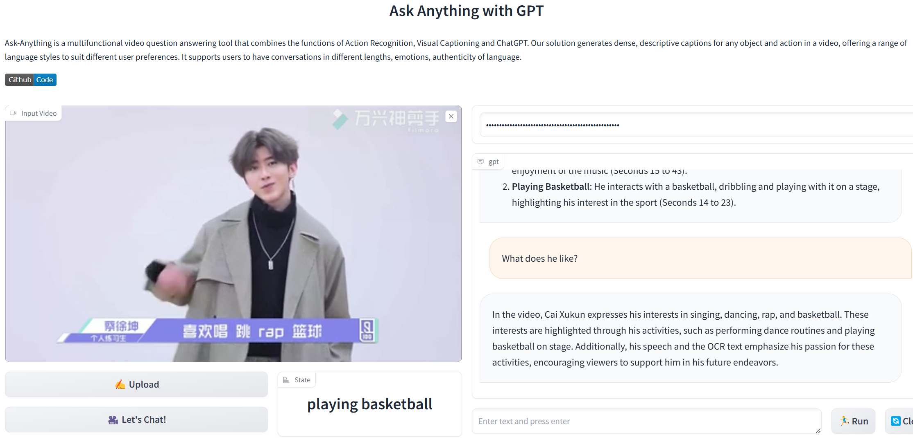

# video_chat_with_ChatGPT_pro

# Project Introduction

This project builds upon the `video_chat_with_ChatGPT` version of the `Ask-Anything` project, introducing comprehensive optimizations. The key contributions of this project include:

1. **Enhanced System Efficiency**:
   - By incorporating a keyframe extraction preprocessing module, the system's efficiency in handling short videos has been significantly improved, and its capability to process long videos has been enhanced.

2. **Improved Language and Text Processing**:
   - The addition of a speech recognition module and a text recognition module has enhanced the system's ability to respond to user queries related to language and text information, providing answers that align with the video content and user expectations.

3. **Accurate Vision-Language Model**:
   - By integrating a more accurate vision-language model and optimizing prompts for the large language model, the project has effectively reduced the issue of model hallucinations, improving system usability and user experience.

These improvements enable the system to perform better in processing video content and interacting with users, providing a more efficient and accurate service.

# Example




## usage
The usage of `video_chat_with_ChatGPT_pro` is similar to the original `video_chat_with_ChatGPT` project. Below is the adapted usage information. For more detailed instructions, please refer to the original project's [usage guide](https://github.com/OpenGVLab/Ask-Anything/tree/main/video_chat_with_ChatGPT).
```shell
# We recommend using conda to manage the environment and use python3.10.10  
conda create -n chatvideo python=3.10.10  
conda activate chatvideo  
  
# Clone the repository:  
git clone https://github.com/lxr12010513/video_chat_with_ChatGPT_pro.git  
cd video_chat_with_ChatGPT_pro
  
# Install dependencies:  
pip install -r requirements.txt  
pip install https://github.com/explosion/spacy-models/releases/download/en_core_web_sm-3.0.0/en_core_web_sm-3.0.0.tar.gz  
python -m pip install 'git+https://github.com/facebookresearch/detectron2.git'  
  
# Download the checkpoints  
mkdir pretrained_models  
wget -P ./pretrained_models https://huggingface.co/spaces/xinyu1205/Tag2Text/resolve/main/tag2text_swin_14m.pth  
wget -P ./pretrained_models https://datarelease.blob.core.windows.net/grit/models/grit_b_densecap_objectdet.pth  
git clone https://huggingface.co/mrm8488/flan-t5-large-finetuned-openai-summarize_from_feedback ./pretrained_models/flan-t5-large-finetuned-openai-summarize_from_feedback  
cd ./pretrained_models/flan-t5-large-finetuned-openai-summarize_from_feedback  
git lfs pull  
cd ../..  
  
# Configure the necessary ChatGPT APIs  
export OPENAI_API_KEY={Your_Private_Openai_Key}  
  
# Run the VideoChat gradio demo.  
python app.py  
```

## Acknowledgements

This project builds upon the fantastic work done in the  `Ask-Anything` project project. We extend our gratitude to the original authors for their contributions to the open-source community.

For more details, please refer to the original project: [Ask-Anything/video_chat_with_ChatGPT](https://github.com/OpenGVLab/Ask-Anything/tree/main/video_chat_with_ChatGPT)

## License

This project is licensed under the MIT License. See the LICENSE file for details.

## Third-Party Code and Licenses

This project incorporates code from the following third-party projects:

- [video_chat_with_ChatGPT](https://github.com/OpenGVLab/Ask-Anything/tree/main/video_chat_with_ChatGPT): Licensed under the MIT License. See `licenses/video_chat_with_ChatGPT_LICENSE.txt` for details.
- [whisper](https://github.com/openai/whisper): Licensed under the MIT License. See `licenses/whisper_LICENSE.txt` for details.
- [PaddleOCR](https://github.com/PaddlePaddle/PaddleOCR): Licensed under the Apache License 2.0. See `licenses/PaddleOCR_LICENSE.txt` for details.
- [moondream](https://github.com/vikhyat/moondream): Licensed under the Apache License 2.0. See `licenses/moondream_LICENSE.txt` for details.
- [AI-Toolbox](https://github.com/monkeyDemon/AI-Toolbox/tree/master/preprocess%20ToolBox/keyframes_extract_tool): the project does not have an explicit license. Users of this project should be aware of this limitation and use the code with caution. If the original author sees this, we would appreciate if you could get in touch with us to resolve the licensing issue.


